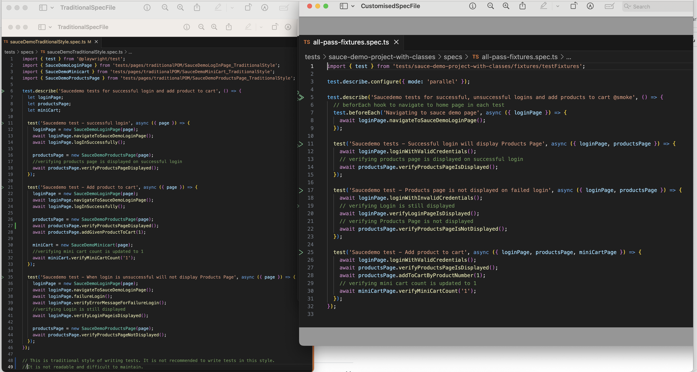
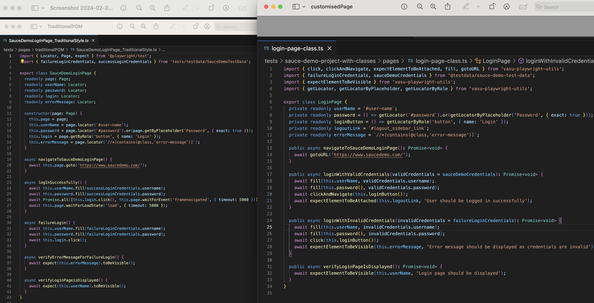
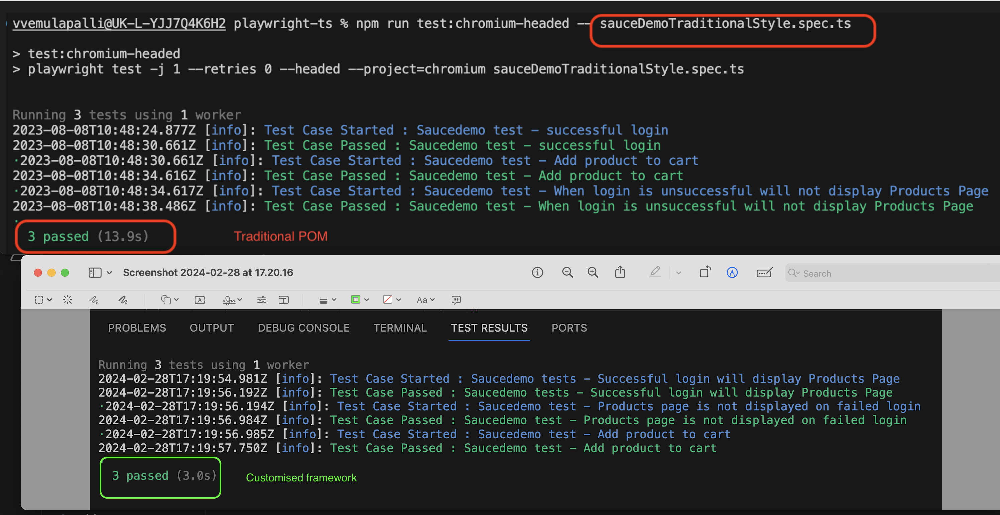

## Page Object Model (POM) Comparison

This framework enables creating Page objects and Spec files using either functions or classes. With the class-based approach, it uses fixtures to initialise the page objects and then passes them as parameters in the spec file tests.

### POM - with Functions

Most of our documentation follow this approach. In the spec files, we do not initialize any page objects. Instead, we import the required functions from the Pages directly and use them as needed.
This method might not support some of the more advanced TypeScript features, such as Decorators, but it's the simplest way to begin if your project doesn't require these advanced capabilities.

This section provides a comparison between Traditional POM and POM with functions in terms of Spec files, Page Objects, and Performance.

### Spec File Comparison (Traditional POM vs. POM with Functions)

The following image illustrates the differences between Traditional and POM with functions in Spec files:

### Page Object Comparison (Traditional POM vs. POM with Functions)

The comparison between Traditional and POM with functions in Page Objects is shown below:

### Performance Comparison (Traditional vs. Customized Framework with functions)

The performance comparison between Traditional POM and Customized Framework with functions is depicted in the following image:

Please refer to `tests\sace-demo-project-with-functions` files for writing page objects and spec files using this approach.

### POM - with Classes

This approach is also different from traditional POM as we use fixtures to initialise Page objects and pass them as parameters in spec file tests. This method will support all the Typescript advanced features.

This section provides a comparison between Traditional POM and POM with classes in terms of Spec files, Page Objects, and Performance.

### Spec File Comparison (Traditional POM vs. POM with Classes)

The following image illustrates the differences between Traditional and POM with classes in Spec files:

### Page Object Comparison (Traditional POM vs. POM with classes)

The comparison between Traditional and POM with classes in Page Objects is shown below:

### Performance Comparison (Traditional vs. Customized Framework with classes)

The performance comparison between Traditional POM and Customized Framework with classes is depicted in the following image:

Please refer to `tests\sace-demo-project-with-classes` files for writing page objects and spec files using this approach.

Note: For more details on Traditional POM, please refer the Playwright documentation [here](https://playwright.dev/docs/pom).
