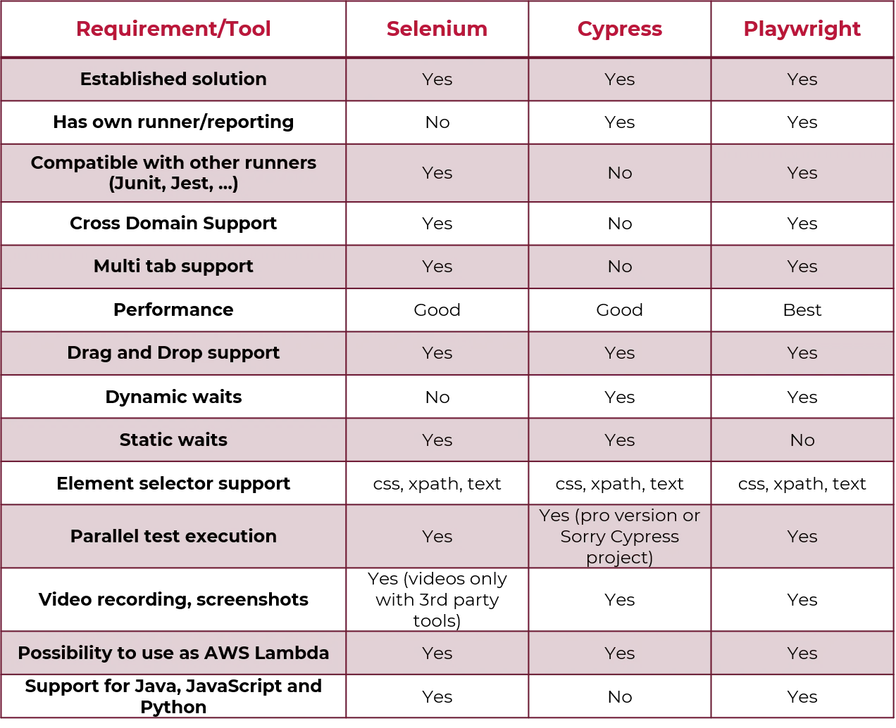

## Why Playwright?

Before we delve into why Playwright might be the best UI tool for your needs, let's briefly explore some other popular UI testing tools that are commonly used in the industry. Understanding their strengths and weaknesses will help us appreciate the unique advantages that Playwright brings to the table.

Selenium WebDriver: Selenium is one of the most widely used UI testing frameworks. It supports multiple programming languages and browsers, making it a versatile choice. However, setting up Selenium can be complex, and it often requires additional tools or wrappers for features like parallel testing and headless browsers.

Cypress: Cypress is known for its speed and ease of use. It's specifically designed for web applications and offers an elegant way to write tests. However, Cypress is limited to running tests in Chrome and Electron, which can be a limitation if cross-browser testing is crucial.

TestCafe: TestCafe is a tool that allows you to write tests in JavaScript or TypeScript and automatically handles web page interactions. It provides built-in parallel testing and multi-browser support, but some users find its documentation and learning curve a bit steep.

Now, let's discuss why Playwright might be the best choice for your UI testing needs:

1. Cross-Browser and Cross-Platform: Playwright supports multiple browsers (Chromium, Firefox, and WebKit) and works on various platforms (Windows, macOS, and Linux). This ensures comprehensive testing across different environments.

2. Single API: Playwright offers a unified and consistent API for automating different browsers. This means you can write tests once and run them across various browsers without significant modifications.

3. Headless and Non-Headless: Playwright provides seamless support for both headless and non-headless browsers, giving you the flexibility to choose based on your testing requirements.

4. Performance: Playwright is built with performance in mind. It employs innovative techniques like browser context sharing to optimize test execution speed.

5. Cross-Device Testing: Playwright's capabilities extend to mobile devices and emulators, allowing you to test your web applications on different screen sizes and resolutions.

6. Robust Automation: Playwright handles complex scenarios like iframes, pop-ups, and shadow DOM elements effectively, making it suitable for testing modern web applications.

7. Reliable Selectors: Playwright offers smart selectors that are less prone to flakiness, reducing the maintenance burden of your test suite.

8. Community and Support: Playwright is an open-source project developed by Microsoft, and it has gained traction within the testing community. It has active maintainers, regular updates, and growing community support.

9. Documentation: Playwright's documentation is comprehensive and well-maintained, making it easier for developers to get started and troubleshoot issues.

10. Ecosystem Integration: Playwright can be integrated with popular testing frameworks like Jest, Mocha, and Jasmine, allowing you to leverage your existing testing setup.

In conclusion, while other UI testing tools like Selenium, Cypress, and TestCafe have their merits, Playwright distinguishes itself through its cross-browser and cross-platform capabilities, consistent API, performance optimizations, robust automation, and comprehensive documentation. Consider these factors in the context of our specific project needs to determine if Playwright is indeed the best choice for our UI testing requirements.

Let's explore the advantages and constraints of some open source tools

## Selenium

Selenium is an open-source suite of tools for testing web applications across different browsers. It was created by Thoughtworks in 2004 and is dedicated to browser application testing. Its components include Selenium Grid, IDE, RC, and WebDriver, supporting browsers like Chrome, Firefox, Safari, and more. Selenium scripts are written in JavaScript, Java, Ruby, C#, or Python.

### Benefits of Selenium:

1. Open source nature amplifies its advantages.
2. Supports popular programming languages: Java, Python, JavaScript, C#, Ruby, Perl.
3. Compatible with major browsers: Firefox, Chrome, Safari, IE, Opera, Edge.
4. User-friendly interface for easy script creation and execution.
5. Reusable test suites across different browsers and OSs.

### Limitations of Selenium:

1. No support for desktop app automation.
2. Reliance on community forums for technical help due to open-source nature.
3. Inability to automate tests for web services like SOAP or REST.
4. Requires familiarity with supported programming languages for WebDriver scripting.
5. Lacks built-in reporting; relies on external plugins like JUnit and TestNG.
6. Cannot perform image testing; requires integration with Sikuli for image-based tests.

## Cypress

Cypress provides a seamless developer experience within an integrated environment.Unlike Selenium, which demands installing various components (Selenium, drivers, libraries) for end-to-end testing, Cypress streamlines the process. This spares testers the laborious framework setup and configuration challenges. Cypress offers a fresh approach to eliminate configuration complexities.

### Benefits of Cypress:

1. Strong E2E testing support.
2. Command Log with step details.
3. Utilize Developer Tools for debugging.
4. Automated waits and assertions.
5. Effortlessly handle functions, server responses, and timers.
6. Convenient access to unit testing features.
7. Efficient control, stubbing, and edge case testing.

### Limitations of Cypress

1. Exclusive support for JavaScript in test creation.
2. Limited iframe compatibility.
3. Lacks multi-tab support.
4. Unsuitable for extensive cross-platform E2E tests due to browser-centric approach.

More infirmation on Why Cypress, can be found [here](https://docs.cypress.io/guides/overview/why-cypress)

## Playwright

Developed by the creators of Puppeteer, Microsoft Playwright stands out for its cross-browser testing capabilities. While sharing similarities with Puppeteer, Playwright goes beyond by efficiently handling Chrome, WebKit, and Firefox browsers.

Playwright's versatility extends to Windows, MacOS, and Linux. It seamlessly integrates with testing frameworks like Jest, Mocha, and Jasmine, easily fitting into CI pipelines through a unified API. Playwright supports multiple languages, including TypeScript, JavaScript, Python, and Java. Additionally, it liberates testers from complex framework setup and configuration tasks.

Precision-engineered for the modern web, Playwright operates swiftly, even in intricate testing endeavors.

### Benefits of Playwright:

1. Intuitive syntax and functional flexibility.
2. Deep integration with modern browser structures.
3. Offers developer access akin to end-users.
4. Auto-wait function minimizes test failures.

### Limitations of Playwright:

1. No support for older Edge or IE11.
2. Capturing media and errors per test, not entire root test.
3. API testing lacks follow redirect disabling.
4. Mobile emulation employs desktop browsers, not actual devices.

For more information on Why Playwright, can be found [here](https://playwright.dev/docs/why-playwright)

### Comparative Analysis Table

